# workshop-Multivariate-analysis
### AIM:
 To Perform Bivariate/Multivariate Analysis

### ALGORITM:
 1. Read the given data 
 2.Get information from the data 
 3.Perform the Bivariate/Multivariate Analysis
 4. Save the clean data to File

### PROGRAM:
```
import pandas as pd
import numpy as np
import seaborn as sns
import matplotlib.pyplot as plt
df = pd.read_csv("FlightInformation.csv")
d
df.head()
df.info()
df.isnull().sum()
df['Route'] = df['Route'].fillna(df['Route'].mode()[0])
df['Total_Stops'] = df['Total_Stops'].fillna(df['Total_Stops'].mode()[0])
df.isnull().sum()
df.shape
plt.figure(figsize=(8,5))
plt.xticks(rotation = 80)
sns.barplot(df["Airline"],df["Price"],hue=df["Total_Stops"])
states=df.loc[:,["Source","Price"]]
states=states.groupby(by=["Source"]).sum().sort_values(by="Price")
plt.figure(figsize=(8,7))
sns.barplot(x=states.index,y="Price",data=states)
plt.xticks(rotation = 90)
plt.xlabel=("SOURCE")
plt.ylabel=("PRICE")
plt.show()
plt.figure(figsize=(5,7))
sns.scatterplot(df['Source'], df['Price'], hue=df['Destination'])
plt.xticks(rotation = 90)
df_count = df.groupby(by=["Source"]).count()
labels=[]
for i in df_count.index:
 labels.append(i)
plt.figure(figsize=(8,8))
colors = sns.color_palette("Set2")
plt.pie(df_count["Price"], colors = colors, labels=labels, autopct = "%0.0f%%",shadow = True) 
plt.title("Source")
plt.show()
df['Airline'].value_counts()
df['Duration'].value_counts()
df_segment = df.groupby(by=["Total_Stops"]).count()
labels = []
for i in df_segment.index:
 labels.append(i)
plt.figure(figsize=(6,6))
colors = sns.color_palette('pastel')
pie = plt.pie(df_segment["Price"], colors = colors, autopct = "%0.0f%%",shadow = True)
plt.title("Total Stops")
plt.legend(pie[0], labels, loc="upper right")
plt.show()
df_region = df.groupby(by=["Destination"]).count()
labels = []
for i in df_region.index:
 labels.append(i)
 
plt.figure(figsize=(8,8))
colors = sns.color_palette('pastel')
pie = plt.pie(df_region["Price"], colors = colors, autopct = "%0.0f%%",shadow = True)
plt.title("Destination")
plt.legend(pie[0], labels, loc="upper right")
plt.show()
```
## OUTPUT:

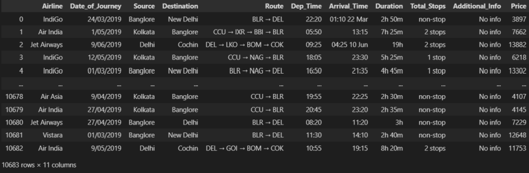


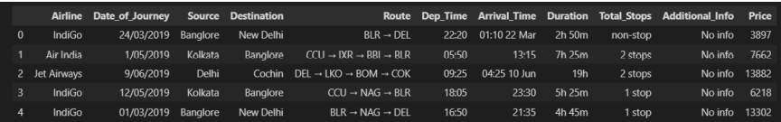


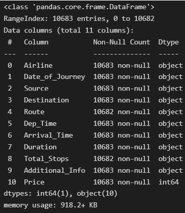


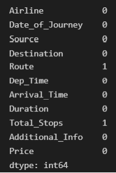


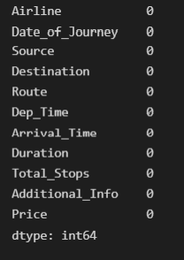


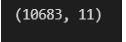


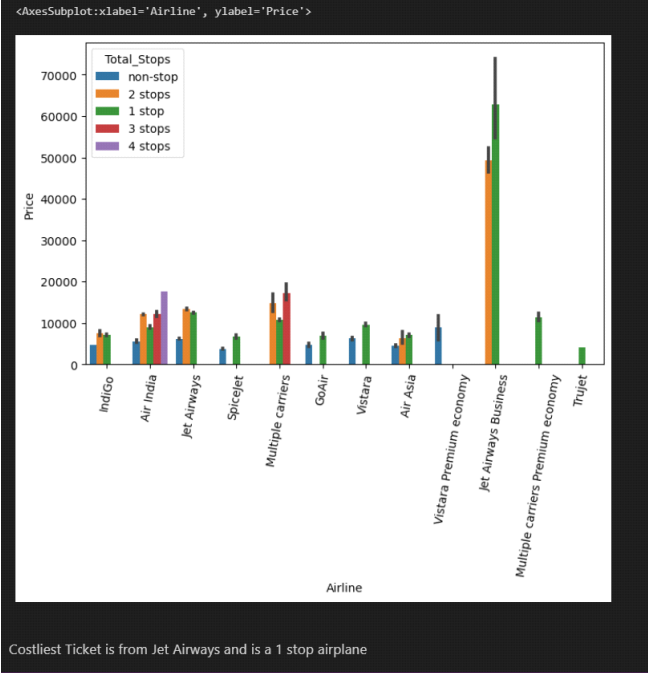


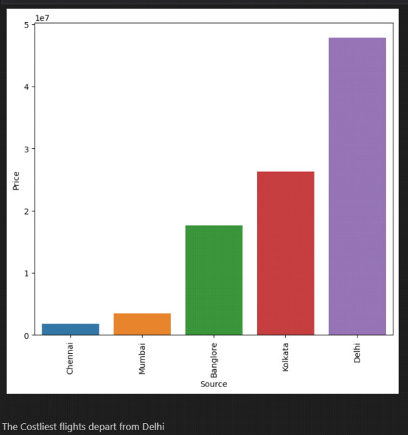


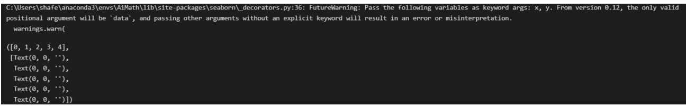


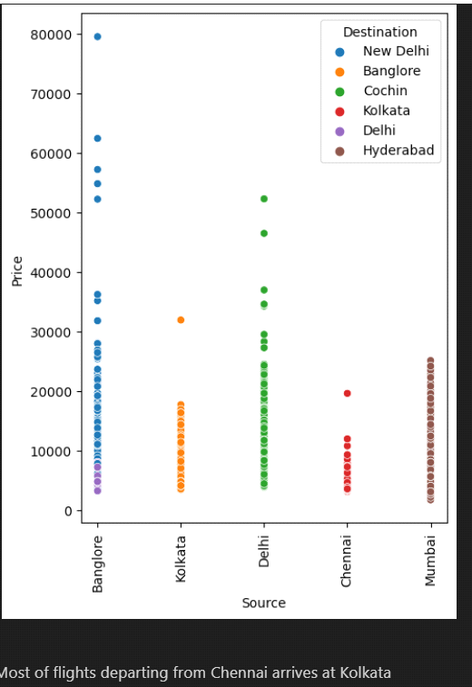


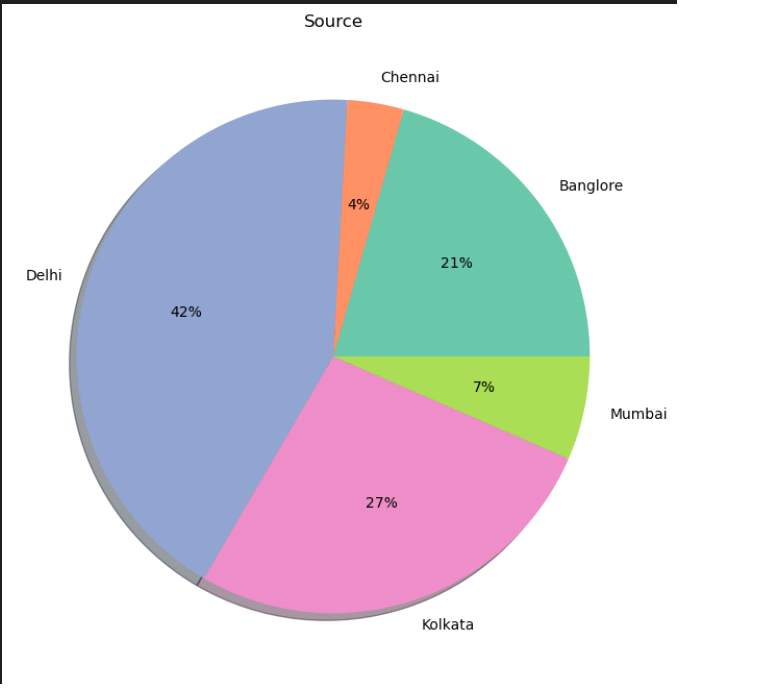


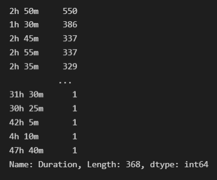


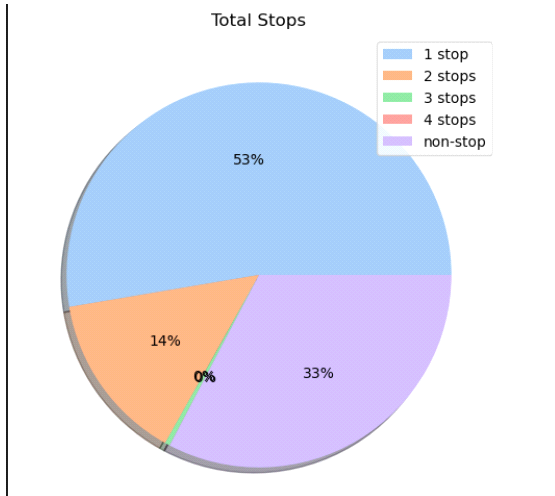


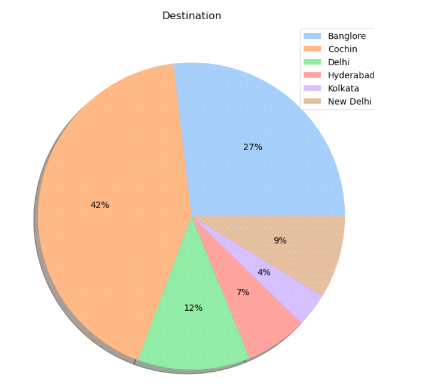


### RESULT:
Thus we applied Bivariate/Multivariate Analysis Successfully


